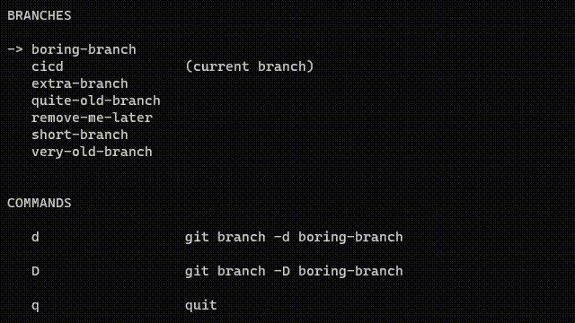

# git-branch-deleter

Delete local git branches comfortably with a minimalistic TUI.



# Installation

```console
cargo install --locked git-branch-deleter
```

# Usage

Run the tool while standing in a git repo:

```console
git-branch-deleter
```
